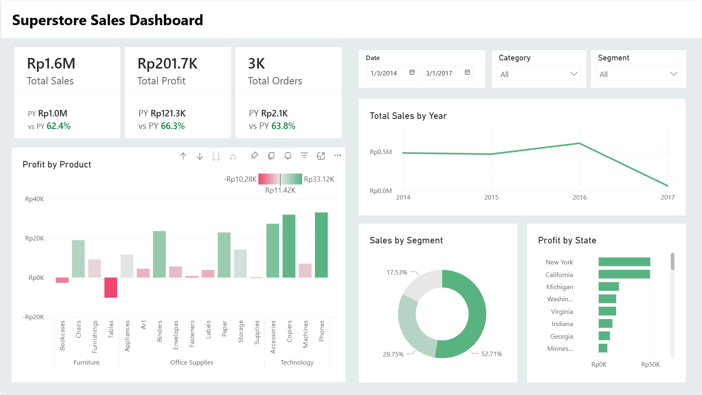

# Superstore Sales Dashboard (Power BI)

This project is a data analysis and visualization dashboard built using **Power BI**.  
The dataset used is the *Sample Superstore* dataset, which contains sales, profit, product, category, segment, and regional information from 2014–2017.

The goal of this project is to understand business performance trends and identify key insights that support decision-making.

---

## Dashboard Overview

The one-page dashboard includes:

### **1. KPI Cards**
- **Total Sales**
- **Total Profit**
- **Total Orders**
- **PY (Prior Year)** comparison for each KPI
- **vs PY (%)** performance indicator

### **2. Visualizations**
- **Sales Trend by Year**  
- **Profit by Product** (colored bar chart: profit vs loss)
- **Sales by Segment** (donut chart)
- **Profit by State** (horizontal bar chart)
- **Slicers** for dynamic filtering:
  - Date
  - Category
  - Segment

---

## Dashboard Screenshot




## Key Insights

- **Sales increased steadily from 2014–2016** The apparent drop in 2017 is due to partial-year data rather than an actual decline.
- **Technology and Office Supplies** contributed the most to profitability, while some Furniture subcategories generated losses.
- **Consumer segment** accounted for the largest share of sales.
- **States such as New York and California** produced the highest profit contribution.
- **All KPIs improved YoY**, showing strong growth momentum.

---

## Skills Demonstrated

- Power BI Data Modeling  
- DAX Measures  
- KPI Card Design  
- Data Cleaning & Formatting  
- Trend Analysis  
- Business Insight Development  
- Dashboard Layout & UX Design  

---

## Project Files

- **.pbix file** (Power BI Dashboard)
- **Dataset (Superstore.xlsx)**
- **Images / Screenshots** of dashboard
- **README.md** documentation

---

## DAX Measures (Key Examples)

```DAX
Total Sales = SUM(Orders[Sales])

Total Profit = SUM(Orders[Profit])

Total Orders = DISTINCTCOUNT(Orders[Order ID])

-- Prior Year Metrics
Sales PY =
CALCULATE([Total Sales], SAMEPERIODLASTYEAR('Calendar'[Date]))

Profit PY =
CALCULATE([Total Profit], SAMEPERIODLASTYEAR('Calendar'[Date]))

Orders PY =
CALCULATE([Total Orders], SAMEPERIODLASTYEAR('Calendar'[Date]))

-- Year-over-Year %
Sales vs PY % =
DIVIDE([Total Sales] - [Sales PY], [Sales PY])

Profit vs PY % =
DIVIDE([Total Profit] - [Profit PY], [Profit PY])

Orders vs PY % =
DIVIDE([Total Orders] - [Orders PY], [Orders PY])
